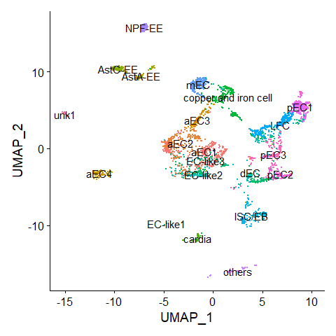
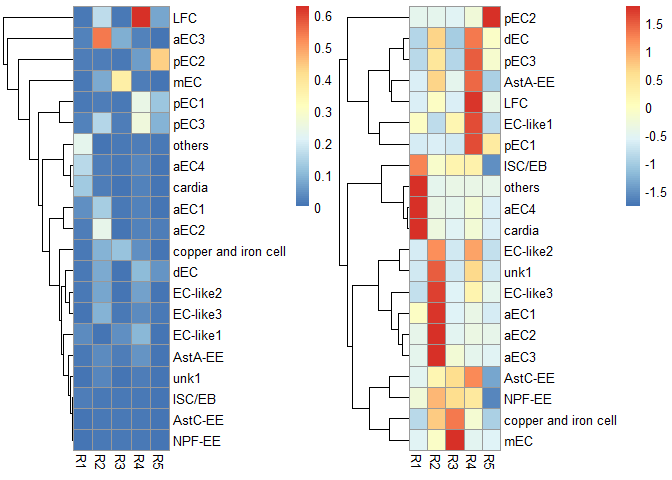
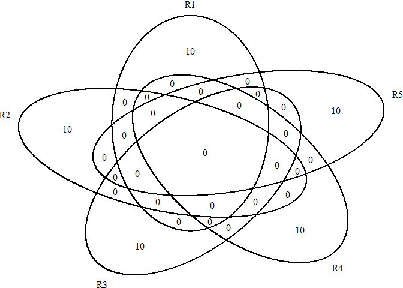
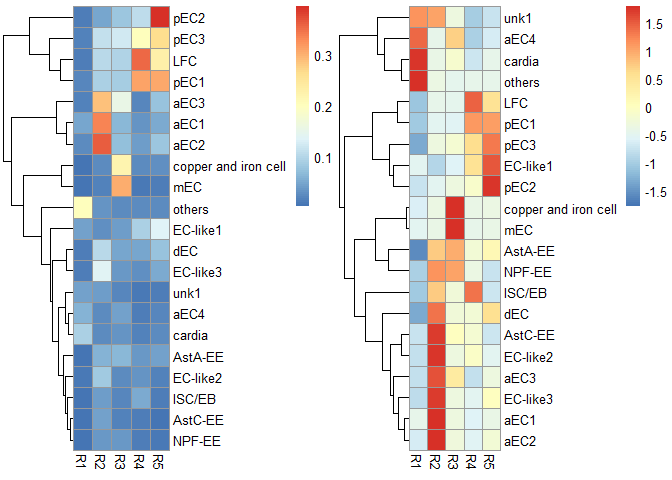
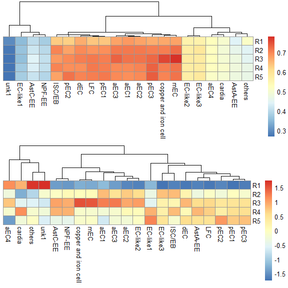
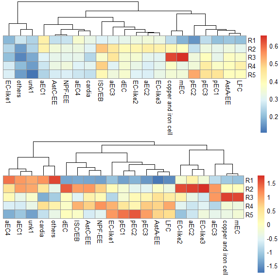
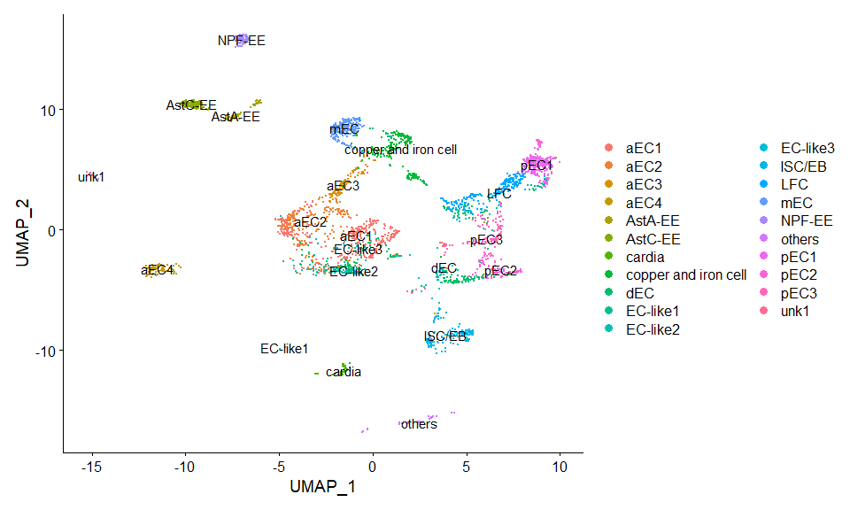
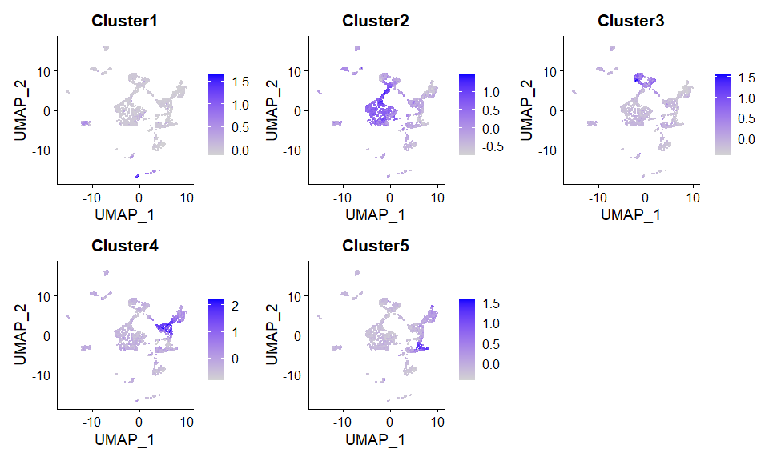

<!-- README.md is generated from README.Rmd. Please edit that file -->

# ScoreRegionPreference

<!-- badges: start -->

[](https://lifecycle.r-lib.org/articles/stages.html#stable)
<!-- badges: end -->

Score the regional preference for scRNAseq cluster based on regional
bulkRNAseq data.

## Installation

You can install the development version of ScoreRegionPreference from
[GitHub](https://github.com/fentouxungui/ScoreRegionPreference) with:

``` r
# install.packages("devtools")
devtools::install_github("fentouxungui/ScoreRegionPreference")
```

## Examples

This is a basic example which shows you how to solve a common problem:

``` r
library(Seurat)
#> Warning: 程辑包'Seurat'是用R版本4.3.1 来建造的
#> The legacy packages maptools, rgdal, and rgeos, underpinning the sp package,
#> which was just loaded, will retire in October 2023.
#> Please refer to R-spatial evolution reports for details, especially
#> https://r-spatial.org/r/2023/05/15/evolution4.html.
#> It may be desirable to make the sf package available;
#> package maintainers should consider adding sf to Suggests:.
#> The sp package is now running under evolution status 2
#>      (status 2 uses the sf package in place of rgdal)
#> Attaching SeuratObject
library(gridExtra)
library(ScoreRegionPreference)
```

### 1. scRNAseq

#### 1.1 Predict Cluster location from bulk RNA-seq

使用EC的各个区段的RNA-seq值，来对单细胞中的各个EC细胞亚群，进行定位预测。

> 单细胞数据来自文章: Hung R J, Hu Y, Kirchner R, et al. A cell atlas of
> the adult Drosophila midgut\[J\]. Proceedings of the National Academy
> of Sciences, 2020, 117(3): 1514-1523.

> RNA-seq数据来自[Flygut-seq: Cell and region specific gene expression
> of the fly midgut](http://flygutseq.buchonlab.com/)

##### 1.1.1 Preparation

将RNAseq里的基因ID转为symbol，注意，要使用与单细胞数据分析用的GTF文件来生成`FlyGeneMeta`。

``` r
# RNAseq data
data(FlyGeneMeta)
data(RNAseq)
head(RNAseq$EC)
#>                     R1         R2         R3         R4         R5
#> FBgn0000003 0.00000000 0.00000000 0.00000000 0.00000000 0.00000000
#> FBgn0000008 0.99406575 1.96251049 0.31337624 1.90011232 0.52664174
#> FBgn0000014 0.02751965 0.14201820 0.10356404 0.30602071 0.15670007
#> FBgn0000015 0.01164936 0.08265733 0.05089256 0.17023985 0.09432941
#> FBgn0000017 0.01560269 0.04168749 0.03383766 0.05107372 0.04774208
#> FBgn0000018 4.01871689 4.47380060 4.42188673 4.79100658 4.35939753
bulkRNAseq <- scRNAseq_Score_Region_Check(RNAseq$EC, FlyGeneMeta)
#> 395 features from data frame not exist in meta file!
head(bulkRNAseq)
#>                        R1         R2         R3         R4         R5
#> 7SLRNA:CR32864 0.00000000 0.00000000 0.00000000 0.00000000 0.00000000
#> a              0.99406575 1.96251049 0.31337624 1.90011232 0.52664174
#> abd-A          0.02751965 0.14201820 0.10356404 0.30602071 0.15670007
#> Abd-B          0.01164936 0.08265733 0.05089256 0.17023985 0.09432941
#> Abl            0.01560269 0.04168749 0.03383766 0.05107372 0.04774208
#> abo            4.01871689 4.47380060 4.42188673 4.79100658 4.35939753
```

``` r
# scRNAseq data
data(scRNA)
scRNA <- UpdateSeuratObject(scRNA)
#> Validating object structure
#> Updating object slots
#> Ensuring keys are in the proper structure
#> Ensuring feature names don't have underscores or pipes
#> Object representation is consistent with the most current Seurat version
DimPlot(scRNA, label = TRUE) + NoLegend()
```



##### 1.1.2 Method 1: Region top Genes in binary mode

``` r
score.list <- scRNAseq_Score_Region(scRNA, bulkRNAseq)
#> 2724 features from RNA-seq not exist in scRNAseq!
scRNAseq_Score_Region_evaluate(score.list, cluster_rows = FALSE, cluster_cols = FALSE, 
                               main = "Gini index of each parameter combination (x - Top Genes, y - UMI Cutoff)")
```


``` r
# correlation of each parameter combination
# scRNAseq_Score_Region_evaluate2(score.list)
```

**使用默认参数，即组合有最大Gini index value。**

``` r
p1 <- scRNAseq_Score_Region_plot(score.list, cluster_cols = FALSE, silent = TRUE)
#> Using UMI Cutoff: 20; Genes Used: 10
p2 <- scRNAseq_Score_Region_plot(score.list, cluster_cols = FALSE, scale = "row", silent = TRUE)
#> Using UMI Cutoff: 20; Genes Used: 10
grid.arrange(p1[[4]],p2[[4]],nrow = 1) & NoLegend()
```



    #> NULL

``` r
# show the selected genes
futile.logger::flog.threshold(futile.logger::ERROR, name = "VennDiagramLogger")
#> NULL
scRNAseq_Score_Region_ExtractFeatures(score.list)
#> Using UMI Cutoff: 20; Genes Used: 10
```



    #> NULL
    #>       R1        R2                R3         R4         R5       
    #>  [1,] "CG17738" "Mal-A7"          "Zip42C.2" "Ser8"     "CG17477"
    #>  [2,] "CG3819"  "CG4830"          "CG6277"   "CG11911"  "CG31265"
    #>  [3,] "CG6839"  "Npc2f"           "CG43789"  "CG11912"  "CG17475"
    #>  [4,] "CG43673" "CG8834"          "Vha100-4" "CG17571"  "CG4053" 
    #>  [5,] "CG11854" "CG15617"         "CG6901"   "Jon99Fi"  "CG6337" 
    #>  [6,] "to"      "CG9682"          "CG31446"  "CG10472"  "CG32379"
    #>  [7,] "CG43134" "Peritrophin-15a" "CG31663"  "Jon99Fii" "CG8774" 
    #>  [8,] "Yp3"     "CG30340"         "CG5770"   "CG7953"   "CG31267"
    #>  [9,] "CG15649" "CG34040"         "CG30479"  "Jon66Ci"  "CG43208"
    #> [10,] "Muc68D"  "CG18404"         "CG17930"  "Jon44E"   "CG32284"

**使用自定义参数，即设定UMI Cutoff为100和选取前100个基因。**

``` r
p1 <- scRNAseq_Score_Region_plot(score.list, 100, 100, cluster_cols = FALSE, silent = TRUE)
p2 <- scRNAseq_Score_Region_plot(score.list, 100, 100, cluster_cols = FALSE, scale = "row", silent = TRUE)
grid.arrange(p1[[4]],p2[[4]],nrow = 1) & NoLegend()
```



    #> NULL

``` r
# show the selected genes
# futile.logger::flog.threshold(futile.logger::ERROR, name = "VennDiagramLogger")
# scRNAseq_Score_Region_ExtractFeatures(score.list, 100, 100)
```

**可以看到，使用这两种参数，都可以准确判定EC亚群的定位，并可以给出更准确的定位。**

##### 1.1.3 Method 2: Expression correlation

**使用所有基因**

``` r
score.matrix <- scRNAseq_Score_Region2(scRNA, bulkRNAseq, Method = "spearman")
#> 2724 features from RNA-seq not exist in scRNAseq!
p1 <- pheatmap::pheatmap(score.matrix, cluster_rows = FALSE, silent = TRUE)
p2 <- pheatmap::pheatmap(score.matrix, scale = "column", cluster_rows = FALSE, silent = TRUE)
grid.arrange(p1[[4]],p2[[4]],nrow = 2) & NoLegend()
```



    #> NULL

**使用Top基因**

``` r
score.matrix <- scRNAseq_Score_Region2(scRNA, bulkRNAseq, Method = "spearman", Genes.Selection = "Top")
#> 2724 features from RNA-seq not exist in scRNAseq!
p1 <- pheatmap::pheatmap(score.matrix, cluster_rows = FALSE, silent = TRUE)
p2 <- pheatmap::pheatmap(score.matrix, scale = "column", cluster_rows = FALSE, silent = TRUE)
grid.arrange(p1[[4]],p2[[4]],nrow = 2) & NoLegend()
```



    #> NULL

**同样使用基于correlation的两种计算方式，也都可以准确判定EC亚群的定位，并可以给出更准确的定位。**

感兴趣的童鞋，可以测试一下用EE的Regional RNA-seq RPKM
value预测EE细胞类群的定位！

##### 1.1.4 compare results from two methods

**计算不同预测方案的cluster \* region 矩阵之间的相关性。**

``` r
head(scRNAseq_Score_Compare(score.list,score.matrix),20)
#>    UMI-20-Genes-40   UMI-200-Genes-40  UMI-2000-Genes-40  UMI-1500-Genes-50 
#>          0.5777317          0.5777317          0.5777317          0.5716270 
#>    UMI-10-Genes-40   UMI-100-Genes-40  UMI-1000-Genes-40    UMI-10-Genes-50 
#>          0.5565741          0.5565741          0.5565741          0.5516927 
#>   UMI-100-Genes-50  UMI-1000-Genes-50    UMI-20-Genes-20   UMI-200-Genes-20 
#>          0.5516927          0.5516927          0.5444626          0.5444626 
#>  UMI-2000-Genes-20   UMI-10-Genes-100  UMI-100-Genes-100 UMI-1000-Genes-100 
#>          0.5444626          0.5440390          0.5440390          0.5440390 
#>  UMI-1500-Genes-40 UMI-1500-Genes-100    UMI-10-Genes-30   UMI-100-Genes-30 
#>          0.5420852          0.5397056          0.5365468          0.5365468
```

#### 细胞水平的基于区域基因的打分

**更推荐的方案：从RNAseq的fastq文件入手，计算各个区域的高表达基因，做成基因集合，然后对每一个单细胞进行region定位的偏好性打分（AddModuleScore？），进而也能推断群水平的region偏好性。**

``` r
pbmc <- AddModuleScore(scRNA, features = score.list$`20`$`20`$Genes)
DimPlot(pbmc, label = TRUE)
```



``` r
FeaturePlot(pbmc,features = paste0("Cluster",1:5), ncol = 3)
```



## Session Info

``` r
sessionInfo()
#> R version 4.3.0 (2023-04-21 ucrt)
#> Platform: x86_64-w64-mingw32/x64 (64-bit)
#> Running under: Windows 10 x64 (build 19045)
#> 
#> Matrix products: default
#> 
#> 
#> locale:
#> [1] LC_COLLATE=Chinese (Simplified)_China.utf8 
#> [2] LC_CTYPE=Chinese (Simplified)_China.utf8   
#> [3] LC_MONETARY=Chinese (Simplified)_China.utf8
#> [4] LC_NUMERIC=C                               
#> [5] LC_TIME=Chinese (Simplified)_China.utf8    
#> 
#> time zone: Asia/Shanghai
#> tzcode source: internal
#> 
#> attached base packages:
#> [1] stats     graphics  grDevices utils     datasets  methods   base     
#> 
#> other attached packages:
#> [1] ScoreRegionPreference_0.0.0.9000 gridExtra_2.3                   
#> [3] SeuratObject_4.1.3               Seurat_4.3.0.1                  
#> 
#> loaded via a namespace (and not attached):
#>   [1] deldir_1.0-9           pbapply_1.7-2          formatR_1.14          
#>   [4] rlang_1.1.1            magrittr_2.0.3         RcppAnnoy_0.0.21      
#>   [7] spatstat.geom_3.2-4    matrixStats_1.0.0      ggridges_0.5.4        
#>  [10] compiler_4.3.0         png_0.1-8              vctrs_0.6.2           
#>  [13] reshape2_1.4.4         stringr_1.5.0          pkgconfig_2.0.3       
#>  [16] fastmap_1.1.1          ellipsis_0.3.2         labeling_0.4.2        
#>  [19] utf8_1.2.3             promises_1.2.0.1       rmarkdown_2.22        
#>  [22] purrr_1.0.1            xfun_0.39              jsonlite_1.8.5        
#>  [25] goftest_1.2-3          highr_0.10             later_1.3.1           
#>  [28] spatstat.utils_3.0-3   irlba_2.3.5.1          parallel_4.3.0        
#>  [31] cluster_2.1.4          R6_2.5.1               ica_1.0-3             
#>  [34] stringi_1.7.12         RColorBrewer_1.1-3     spatstat.data_3.0-1   
#>  [37] reticulate_1.30        parallelly_1.36.0      lmtest_0.9-40         
#>  [40] scattermore_1.2        Rcpp_1.0.10            knitr_1.43            
#>  [43] tensor_1.5             future.apply_1.11.0    zoo_1.8-12            
#>  [46] VennDiagram_1.7.3      sctransform_0.3.5      httpuv_1.6.11         
#>  [49] Matrix_1.5-4           splines_4.3.0          igraph_1.4.3          
#>  [52] tidyselect_1.2.0       abind_1.4-5            rstudioapi_0.14       
#>  [55] yaml_2.3.7             spatstat.random_3.1-5  codetools_0.2-19      
#>  [58] miniUI_0.1.1.1         spatstat.explore_3.2-1 listenv_0.9.0         
#>  [61] lattice_0.21-8         tibble_3.2.1           plyr_1.8.8            
#>  [64] withr_2.5.0            shiny_1.7.4            ROCR_1.0-11           
#>  [67] evaluate_0.21          Rtsne_0.16             lambda.r_1.2.4        
#>  [70] future_1.33.0          survival_3.5-5         futile.logger_1.4.3   
#>  [73] polyclip_1.10-4        fitdistrplus_1.1-11    pillar_1.9.0          
#>  [76] KernSmooth_2.23-20     plotly_4.10.2          generics_0.1.3        
#>  [79] sp_2.0-0               ggplot2_3.4.4          munsell_0.5.0         
#>  [82] scales_1.3.0           globals_0.16.2         xtable_1.8-4          
#>  [85] glue_1.6.2             pheatmap_1.0.12        lazyeval_0.2.2        
#>  [88] tools_4.3.0            data.table_1.14.8      RANN_2.6.1            
#>  [91] leiden_0.4.3           cowplot_1.1.1          grid_4.3.0            
#>  [94] tidyr_1.3.0            colorspace_2.1-0       nlme_3.1-162          
#>  [97] patchwork_1.1.2        cli_3.6.1              spatstat.sparse_3.0-2 
#> [100] futile.options_1.0.1   ineq_0.2-13            fansi_1.0.4           
#> [103] viridisLite_0.4.2      dplyr_1.1.2            uwot_0.1.16           
#> [106] gtable_0.3.3           digest_0.6.31          progressr_0.14.0      
#> [109] ggrepel_0.9.3          farver_2.1.1           htmlwidgets_1.6.2     
#> [112] htmltools_0.5.5        lifecycle_1.0.3        httr_1.4.6            
#> [115] mime_0.12              MASS_7.3-58.4
```
